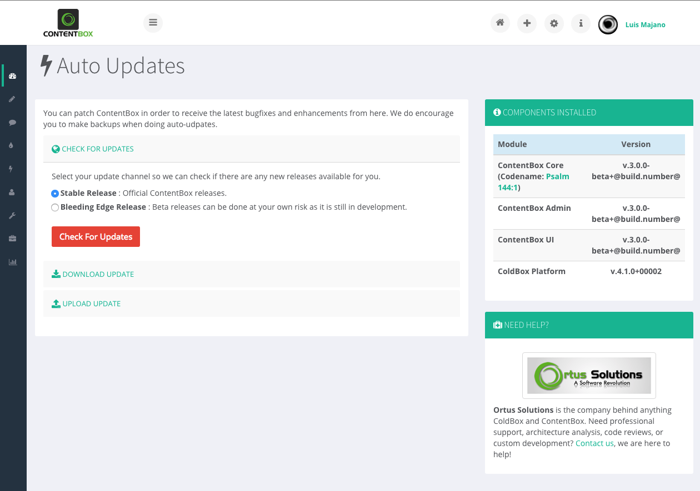

# Upgrading ContentBox



ContentBox sports automatic updates via the administrator panel `Dashboard > Updates`. You can connect to the following update channels:

* **Stable**: Where all our official stable releases go
* **Bleeding Edge**: This is where we release beta or test versions

Once an auto-update package is detected you can then opt to install it.

**As with all automated installers, we recommend you create backups of your source and database before applying or at least testing in a staging or development version of your site.**

## Database Migrations

ContentBox contains Database migrations for you. It will only do additive migrations, so no remove or dropping ever occurs on patches. We highly advice you to do so and point you in the right direction via the release notes.

## Manual Uploading Patches

Once a patch is released in our update sites you can then choose to manually download the patch and apply it manually yourself. We store all patches in our integration server that can be found here:

```text
// Artifacts Server
https://downloads.ortussolutions.com/
```

Or you can visit [www.ortussolutions.com/products/contentbox](https://www.ortussolutions.com/products/contentbox) for all the available download patches.

### Patch Types

There are three types of patches you can manually download and apply:

* **Full Patch**: Includes source, framework and database content updates
* **Database Patch**: Includes database content updates only
* **No ColdBox**: Includes source and database content updates only

### Patch Structure

Each patch contains the following structure:

* `Update.cfc`  : Contains the code needed for pre and post installation procedures
* `deletes.txt` : Contains a list of all source files that will be removed from your installation
* `patch.zip` : Contains all the new or modified source files that need to be deployed

  You can then use the upload patch functionality in our Updates panel to upload the patch and install it.

We do not recommend running the `Update.cfc` or patch files manually. Let the installer do its job.

## Manual Downloading Patches

You can also use the Updates panel to point to a download URL so ContentBox can be patched via a patch URL. This functionality is mostly used by our support customers so we can deliver on-demand patches to their ContentBox instances. You can also use this approach to deliver patches to a local intranet of ContentBox instances. Just type in the download URL and hit update!

## CommandBox Updates

If you are using the `contentbox` module approach via CommandBox, you can easily upgrade by doing two things:

1. Issue an update command: `box update contentbox`. This will update the module to its latest version
2. Apply the `db-only` patch in your administrator

Then restart your engine.

## Professional Updating

The ContentBox team can also do the heavy lifting for you as we are a professional open source project. So just contact us and we will update or install any ContentBox instances in a secure and fast way!

