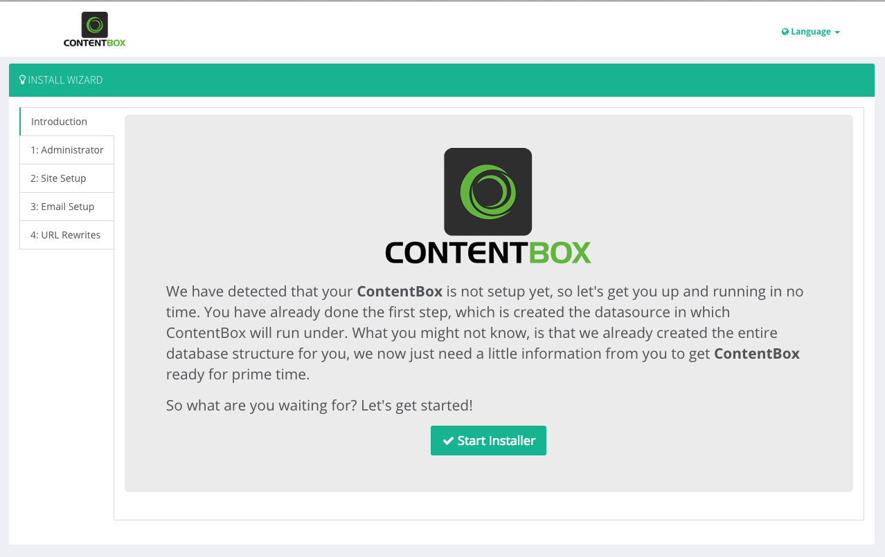

# WAR Installation

In this section you will install ContentBox by using the **war** download option and deploying it to any Java 1.7+ servlet container.

## Step 1: Download WAR

The first step is for you to download ContentBox \([http://www.ortussolutions.com/products/contentbox](http://www.ortussolutions.com/products/contentbox)\) or you can use the command below:

```text
# stable
wget http://www.ortussolutions.com/parent/download/contentbox?type=war

# bleeding edge
wget http://www.ortussolutions.com/parent/download/contentbox?type=war&version=be
```

## Step 2: Deploy WAR

Drop the war into the web application folder of your favorite servlet container or use any of their deployment tools to do so. Then startup the engine and let the war be expanded.

## Step 3: Create Your Database

Now that the war is deployed in your server, it is time to create your database in your favorite DBMS engine. ContentBox is built with Hibernate ORM technology, so in theory it should work in all major database systems. You can even use an embedded database like Apache or Hypersonic.

Make sure your database supports `utf-8 or utf-16` character sets if you will be using multi-lingual or localization support.

## Step 4: Create A Datasource


You can now visit your application and will be presented with our datasource wizard. You can either use our datasource wizard or you can create the datasource yourself manually in the CFML administrator by visiting the URL for the administrator:

```text
/{appcontext}/lucee/admin/server.cfm
```

## Step 5: Run ContentBox Installer



That's it! We are now ready to run the ContentBox installer wizard. ContentBox will automagically create all the necessary database tables, indexes and constraints for you. After it does this, it will present you with our ContentBox installer, where you will fill in:

* Administrator Account
* Site Information
* Notification Emails
* Email Information
* URL Rewriting
* Enjoy your ContentBox installation!

> **Caution** We recommend that after you install ContentBox that you remove the installer and datsource wizard modules from disk. You can do so manually or via the Dashboard once you log in. `{Root}/modules/contentbox-installer and {Root}/modules/contentbox-dsncreator`

