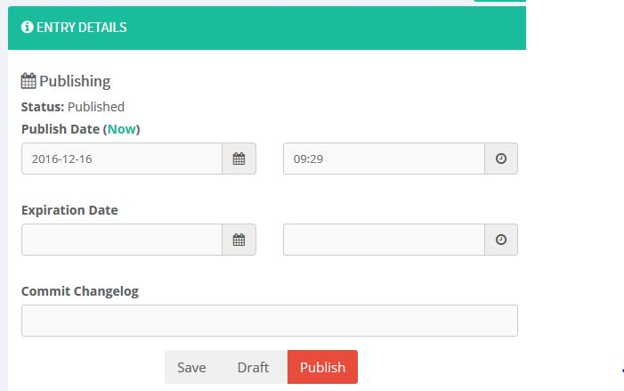
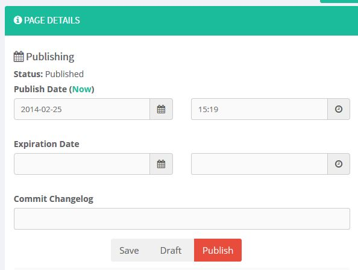

# Scheduled Content

Running a website, on top of your normal job duties can be a lot of work. Time is valuable, and important when trying to plan your content and the corresponding social media publication. This is the reason why we created an important \( but often overlooked \) feature, Publication and Expiration dates for content. You might be surprised what in ContentBox is date controlled.

## Blog Posts

This is most useful when scheduling blog posts. Blog posts can take a long time to write, and post, and with busy schedules this might not get done. This is why at Ortus Solutions, we try to write our blog posts, and schedule them ahead of time. When editing a blog post, in the right hand side 'sidebar', you will see these options at the top of the sidebar.

You can set the publish date / time, and the post will go live at the right time for you.

Expiration dates are useful too, but not a normal use case for blog posts… but these scheduling options are not just available for blog posts. Expiration dates work great for webinars or other events, where a sign up page should be removed after event sign ups close, or maybe a special or promotion that should only who while it's active. This will even show and hide menu items in your navigation.

## Pages

Lets look at the Page Details version of the Publishing options

As you can see, they are exactly the same. This makes it familiar and easy to work with. This is also the case for Content Store items… which gives you even more options in regards to scheduling content.

## Content Store Items

ContentStore items can be included inside of pages and blog posts too, which means you can include a time based piece of content into your homepage, to show upcoming events, or show a link to a sign up page for event, and then hide the link when the registration period is over.

This is a nice feature, which at the surface looks simple but useful, but with this feature working with ContentStore items as well, the options are endless.

